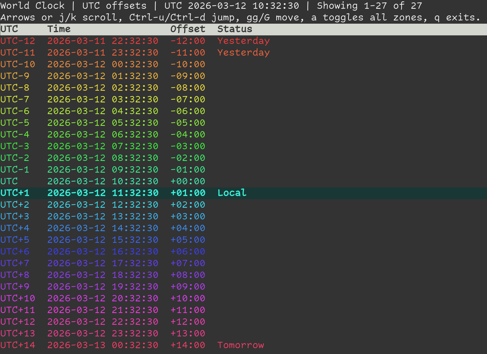

# World Clock

> Disclaimer: this project is completely vibecoded.

A small Rust terminal UI that shows the current time across UTC offsets or the full IANA timezone list.



<video src="img/demo.webm" controls></video>

## Features

- Live-updating clock display in a terminal UI
- Two views: compact UTC offsets and full timezone database
- Scrollable table with keyboard navigation
- Highlights the local timezone offset and marks yesterday/tomorrow differences

## Run

```bash
cargo run --release
```

## Controls

- `q` or `Esc`: quit
- `a`: toggle between UTC offsets and all IANA zones
- `Up` / `k`: scroll up
- `Down` / `j`: scroll down
- `PageUp`: jump up one page
- `PageDown`: jump down one page
- `Ctrl-u`: jump up half a page
- `Ctrl-d`: jump down half a page
- `gg` or `Home`: jump to the top
- `G` or `End`: jump to the bottom

## Notes

- Built with `ratatui` and `crossterm`
- Timezone data comes from `chrono-tz`
- If the terminal window is too small, the app shows a resize warning instead of the table
# worldclock-tui-rs
